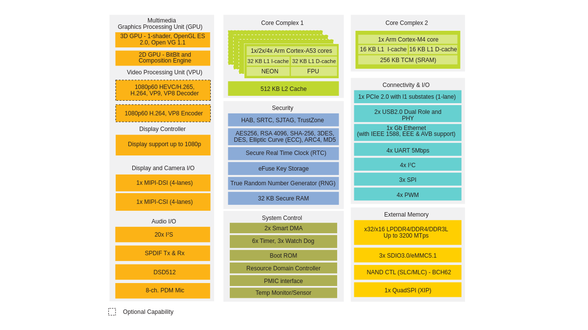

import socUrl from './assets/soc.png';

# SOC

This multicore processing platform is engineered to deliver high performance and versatility across a range of applications. Featuring a quad-core Cortex-A53 CPU cluster, each core operating at up to 1.8GHz, this platform is designed for tasks that demand both speed and efficiency. Complementing the Cortex-A53 cluster is a Cortex-M4 core, optimized for low-power operations at up to 400MHz. The platform also boasts a comprehensive set of features, including advanced 3D and 2D graphics processing, extensive multimedia support, and robust connectivity options. With support for multiple operating systems, this platform is suitable for consumer electronics, industrial applications, and more.

| **Feature**               | **Specifications**                                                                                                 |
|---------------------------|------------------------------------------------------------------------------------------------------------------|
| **Multicore Processing**  | 4x Cortex-A53 core platforms up to 1.8GHz per core  
|                           | 32KB L1-I Cache/ 32 kB L1-D Cache  
|                           | 512 kB L2 Cache  
|                           | 1x Cortex-M4 core up to 400MHz  
|                           | 16 kB L1-I Cache/ 16 kB L2-D Cache                                                                                 |
| **GPU**                   | 3D GPU (1x shader, OpenGL ES 2.0) ®  
|                           | 2D GPU                                                                                                             |
| **Display Interface**     | 1x MIPI DSI (4-lane) with PHY                                                                                      |
| **Video Playback**        | 1080p60 VP9 Profile 0, 2 (10-bit) decoder, HEVC/H.265 decoder, AVC/H.264 Baseline, Main, High decoder, VP8 decoder  
|                           | 1080p60 AVC/H.264 encoder, VP8 encoder                                                                              |
| **Audio**                 | 5x SAI (12Tx + 16Rx external I2S lanes), 8ch PDM input                                                                                                  |
| **Camera Interface**      | 1x MIPI CSI (4-lane) with PHY                                                                                                                           |
| **USB**                   | 2x USB 2.0 OTG controllers with integrated PHY                                                                                                          |
| **PCIe**                  | 1x PCIe 2.0 (1-lane) with L1 low power substates                                                                                                        |
| **Ethernet**              | 1x Gigabit Ethernet (MAC) with AVB and IEEE 1588, Energy Efficient Ethernet (EEE) for low power                                                         |
| **Operating Systems**     | Linux, Android, Windows 10 Enterprise, FreeRTOS                                                                                                        |
| **Temperature**           | Consumer (0°C to 95°C Tj)  
|                           | Industrial (-40°C to 105°C Tj)                                                                                                                         |
| **Package**               | FCBGA, 14x14 0.5mm pitch                                                                                                                                |

This multicore processing platform represents a powerful and flexible solution for modern embedded systems. Its combination of high-speed processing, rich multimedia capabilities, and broad connectivity options makes it ideal for a variety of use cases. Whether you're developing for consumer markets or industrial environments, this platform provides the performance and adaptability needed to meet your project's requirements. With its support for multiple operating systems and temperature ranges, it is well-equipped to handle the demands of today's diverse technological landscape.