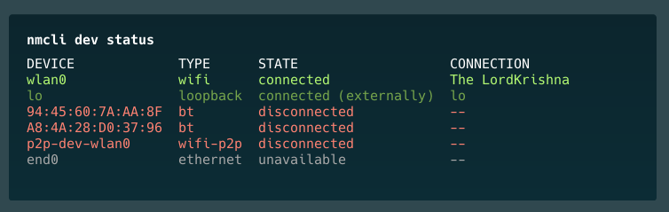
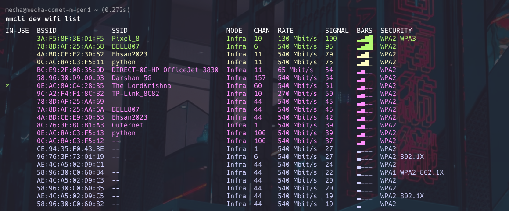
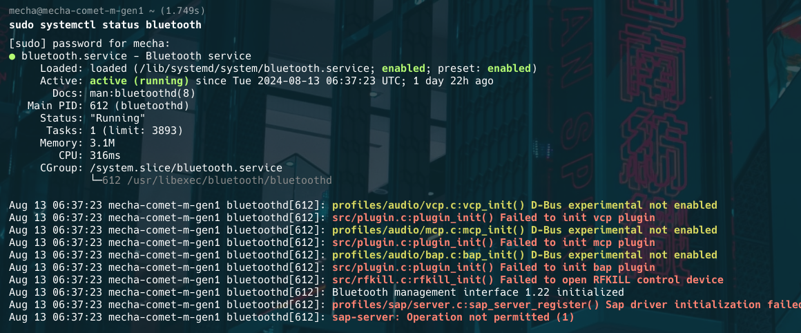
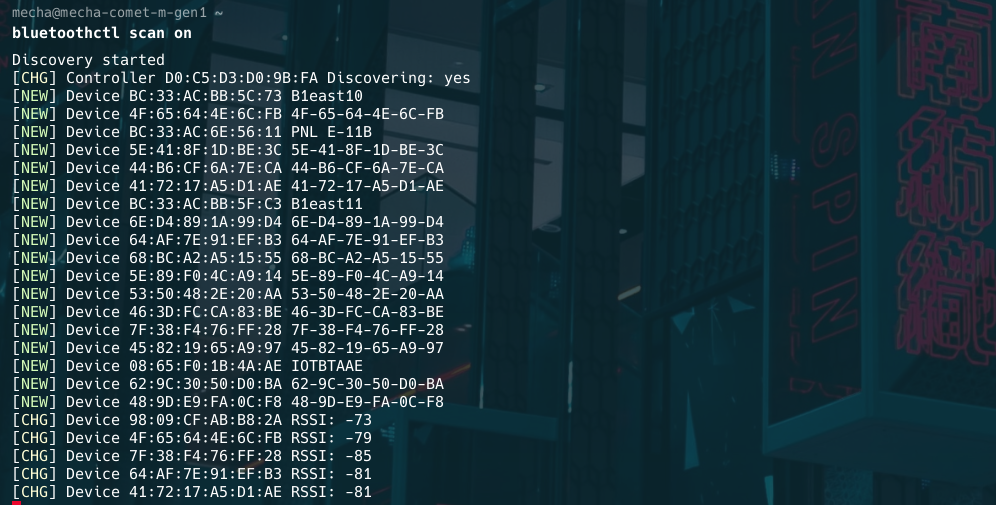
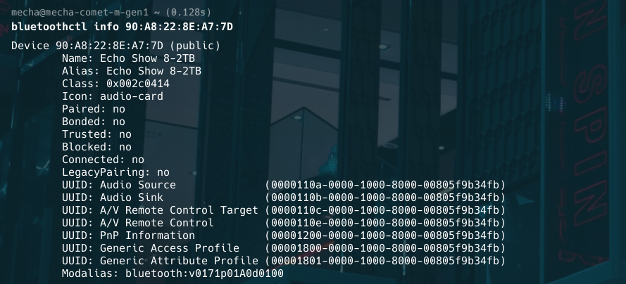

import bt1Url from './assets/bt1.png';
import bt2Url from './assets/bt2.png';
import bt3Url from './assets/bt3.png';
import bt4Url from './assets/bt4.png';
import bt5Url from './assets/bt5.png';
import bt6Url from './assets/bt6.png';

# Wireless/BT

## WIFI

**Connect to WiFi network on Mecha device

You’re having WiFi that supports  2.5/5 ghz bandwidth 

You’re using nmcli to interact with network wifi device onboard

### **1. List Available Device Interfaces**

To see all available WiFi networks:

```bash
nmcli device status

```



If you’re not sure on status of your wifi device

To get status of wifi device:

```bash
nmcli radio wifi
```

To turn WiFi on:

```bash
nmcli radio wifi on
```

To turn WiFi off:

```bash
nmcli radio wifi off
```

### **2. List Available WiFi Networks**

To see all available WiFi networks:

```bash
nmcli device wifi list
```



### **3. Connect to a WiFi Network (may require sudo )**

To connect to a WiFi network:

```bash
nmcli device wifi connect SSID-Name password wireless-password
```

Replace "SSID-Name" with the network name and "wireless-password" with the actual password.

Alternatively, if you don't want to write out your password onscreen, you can use the **--ask** option:

```

nmcli --ask dev wifi connect network-ssid
```

### **4. Connect to a Hidden WiFi Network**

For hidden networks:

```bash
nmcli device wifi connect SSID-Name password wireless-password hidden yes
```

### **5. Disconnect from WiFi**

To disconnect the current WiFi connection:

```bash
nmcli device disconnect wlan0
```

Replace "wlan0" with your wireless interface name if different.

### **6. Show Saved Connections**

To list all saved connections:

```bash
nmcli connection show
```

### **7. Connect to a Saved Network**

To connect to a previously saved network:

```bash
nmcli connection up id NetworkName
```

### **8. Forget a Saved Network**

To remove a saved network:

```bash
nmcli connection delete id NetworkName
```

### **9. Get Details of Current Connection**

To see details of the active connection, including password:

```bash
nmcli device wifi show-password
```

### **10. Modify a Connection**

To change the password of a saved network:

```bash
nmcli connection modify id NetworkName wifi-sec.psk "new-password"
```

### **11. Create a New Connection Without Connecting**

To add a new connection without immediately connecting:

```bash
nmcli connection add type wifi con-name "ConnectionName" ifname wlan0 ssid "SSID-Name"
nmcli connection modify "ConnectionName" wifi-sec.key-mgmt wpa-psk wifi-sec.psk "password"
```

### **12. Scan for New Networks**

To refresh the list of available networks:

```bash
nmcli device wifi rescan
```

---

## Bluetooth


### **1. Checking Bluetooth Status**

Before you can add Bluetooth devices, the Bluetooth service on your computer must be up and running. You can check it with the help of the **systemctl** command.

```bash
sudo systemctl status bluetooth
```



If the Bluetooth service status is not active you will have to enable it first. Then start the service so it launches automatically whenever you boot your computer.

```bash
sudo systemctl enable bluetooth
sudo systemctl start bluetooth
```

### **2. Scanning for Nearby Devices**

To actively search for Bluetooth devices that you can connect to, use the **scan** command as follows:

```bash
bluetoothctl scan on
```

**Note**: If you can't find the Bluetooth device you are looking for, make sure that your system Bluetooth is discoverable.

To make your Bluetooth adaptor discoverable to other devices, use the following command:

```bash
bluetoothctl discoverable on
```



You can also list devices that are within the Bluetooth range of your computer using the command below:

```bash
bluetoothctl devices
```


### **3. Connecting to Your Device**

Now that you have a list of Bluetooth devices you can connect to, use the MAC address to connect to a particular device.

The simplest way to connect with a Bluetooth device is to pair it with your PC using the **pair** command.

```bash
bluetoothctl pair 90:A8:22:8E:A7:7D
```

**Note**: Remember to replace the MAC address 90:A8:22:8E:A7:7D used in this guide with the respective MAC address of your device.

### **4. Trusting Paired Devices**

In addition to pairing with a Bluetooth device, you can also choose to trust certain devices so that you easily connect to them in the future.

To trust a Bluetooth device:

```bash
bluetoothctl trust 90:A8:22:8E:A7:7D
```

You can untrust a device by issuing the following command:

```bash
bluetoothctl untrust 90:A8:22:8E:A7:7D
```

### **5. Connect to a Device**

```bash
bluetoothctl connect [MAC address]
```

### **6. Disconnect from a Device**

```bash
bluetoothctl disconnect [MAC address]
```

### **7. Remove a Paired Device**

```bash
textbluetoothctl remove [MAC address]
```

### **8. Get Device Info**

```bash
bluetoothctl info [MAC address]
```


This guide should help you get started with using wifi and bluetooth devices on Mecha Device
or any Debian based linux system